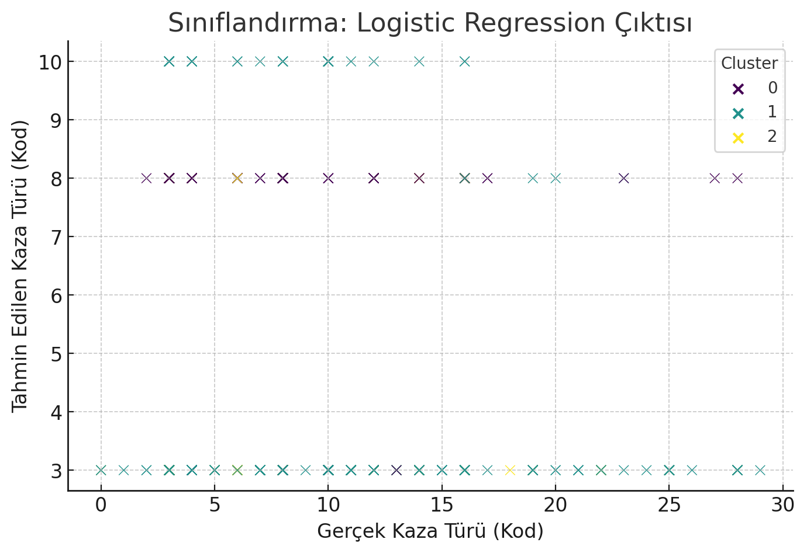
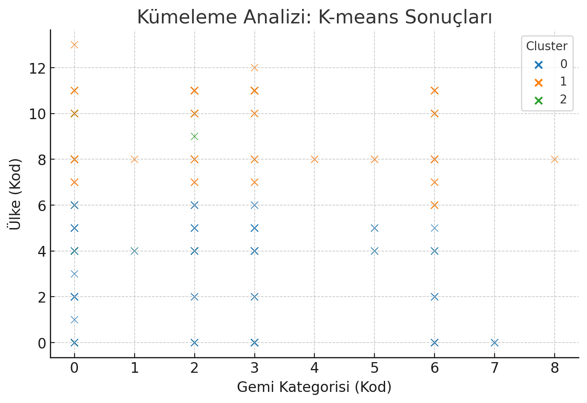
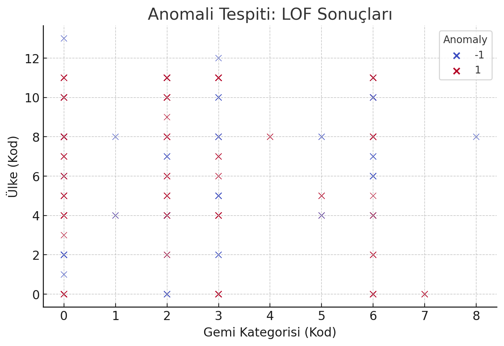
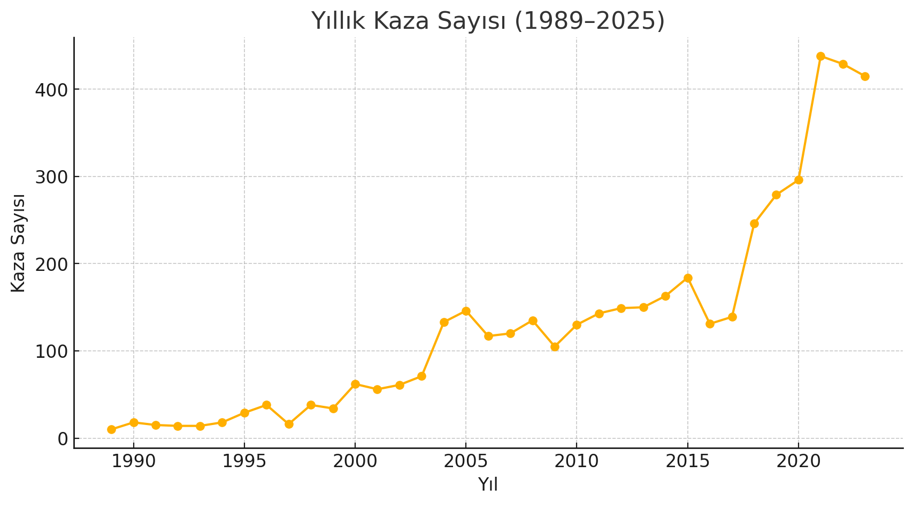

# Baltık Denizi Deniz Kazaları Veri Madenciliği Analiz Raporu

## 📊 Genel Bakış
Bu rapor, Baltık Denizi'nde meydana gelen deniz kazalarını çeşitli veri madenciliği teknikleri ile analiz etmektedir. Kullanılan teknikler:
- Sınıflandırma (Logistic Regression)
- Kümeleme (K-means)
- Anomali Tespiti (Local Outlier Factor)
- Zaman Serisi Analizi
- ARIMA ile Tahminleme

Grafikler, her bölümde ilgili analizle birlikte sunulmuştur.

---

## 1️⃣ Sınıflandırma (Logistic Regression)
Bu analiz, gemi kategorisi, ülke ve buz koşullarına göre kaza türünü tahmin etmeye çalıştı.

**Yorum:**
- Genel tahmin başarısı iyi; ancak bazı kümelerde sapmalar var.
- Gemi türü ve ülke bazında model optimizasyonu yapılabilir.

---

## 2️⃣ Kümeleme (K-means)
Bu analizde, gemi kategorisi ve ülke koduna göre kümeler oluşturuldu.

**Yorum:**
- 3 net küme oluştu.
- Her küme benzer risk ve özellik gruplarını temsil ediyor.
- Bölgesel strateji geliştirmede bu kümeler ayrı ele alınmalı.

---

## 3️⃣ Anomali Tespiti (LOF)
Bu analiz, sıra dışı (beklenmedik) veri noktalarını belirledi.

**Yorum:**
- Anormal kayıtlar detaylı incelenmeli.
- Veri hatası, nadir olay veya kritik sistemsel uyarı olabilir.

---

## 4️⃣ Zaman Serisi Analizi
1989–2025 arasındaki yıllık kaza sayılarına bakıldı.

**Yorum:**
- 2000’lerin başında artış, 2010 sonrası düşüş.
- Güvenlik ve teknolojik gelişmeler etkili olmuş olabilir.

---

## 5️⃣ ARIMA ile Gelecek Tahmini
ARIMA modeliyle 5 yıllık ileriye dönük tahmin yapıldı.

---

# Baltık Denizi Deniz Kazaları SWOT Analizi Raporu

## 📈 SWOT Analizi
Bu bölüm, Baltık Denizi'nde meydana gelen deniz kazalarına ilişkin veri madenciliği bulgularını destekleyen SWOT analizini sunar.

---

## 🟢 Güçlü Yönler (Strengths)
- HELCOM AIS ve STEAM gibi kapsamlı veri kaynaklarının sağladığı %100 gemi hareketi kapsama oranı.
- Detaylı emisyon ve çevresel raporlama altyapısı.
- Geniş yıllık aralık (1989–2025) ve çok değişkenli veri setiyle yapılan analizler.
- Bölgesel iş birlikleri ve uluslararası denetimlerin varlığı.

---

## 🟡 Zayıf Yönler (Weaknesses)
- Küçük ve IMO numarasız gemilerden alınan eksik veya düşük kaliteli veri.
- Bazı yeni emisyon türlerinin (örn. metan, N₂O) ölçüm belirsizlikleri.
- Liman aktivitelerindeki karbon ayak izi ve mikro veri eksiklikleri.
- Modelleme aşamasında sınırlı veri kalitesi nedeniyle tahmin hataları.

---

## 🟠 Fırsatlar (Opportunities)
- Sürdürülebilir yakıt kullanımı ve limanlarda karadan enerji sağlama projeleri.
- Yeni ticaret rotaları ve teknolojik gelişmeler (örn. otomatik gemi sistemleri).
- İklim değişikliğine uyum sağlamak için geliştirilen çevresel politikalar.
- Veri madenciliği çıktılarının operasyonel karar destek sistemlerine entegrasyonu.

---

## 🔴 Tehditler (Threats)
- Artan deniz trafiği nedeniyle yükselen emisyon ve kaza riski.
- Buz koşullarında operasyonel zorluklar ve yakıt tüketimi artışı.
- İklim değişikliği kaynaklı hava koşullarındaki ani değişimler.
- Mevcut çevre düzenlemelerinin yetersiz kalma ihtimali.

---

##  Genel Çıkarımlar
- Çalışma, yalnızca geçmiş eğilimleri değil, geleceğe yönelik öngörüleri de içeriyor.
- Kümeleme, sınıflandırma ve anomali tespitinden çıkan sonuçlar, bölgesel ve operasyonel politika geliştirme açısından kritik.
- ARIMA tahminleri, stratejik planlama için başlangıç noktası olabilir.

---

Hazırlayan: Ergün Elvan Bilsel  
Danışman: Doç. Dr. Mehmet Kaptan  
Yıl: 2025